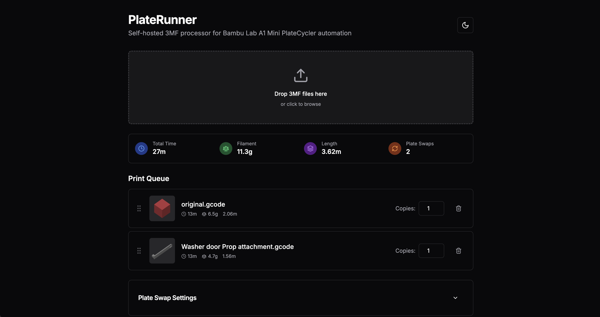

# PlateRunner

**Yes, this was vibe coded.** 🤖

Self-hosted 3MF processor for Bambu Lab A1 Mini PlateCycler automation. Combines multiple print jobs with automatic plate swapping sequences for unattended batch printing.



## Features

- **Drag & Drop 3MF Processing** - Upload multiple Bambu Lab 3MF files
- **Batch Print Queue** - Reorder jobs and set copy counts
- **Automatic Plate Swapping** - Injects G-code sequences for PlateCycler automation
- **Real-time Statistics** - View total print time, filament usage, and plate swaps
- **Custom Swap Sequences** - Configure and save custom plate swap G-code
- **Dark Mode Support** - Toggle between light and dark themes
- **Self-hosted** - Runs entirely in your browser, no external dependencies

## Quick Start

### Prerequisites

- Node.js 18+ 
- Bambu Lab A1 Mini with PlateCycler accessory
- 3MF files exported from Bambu Studio

### Installation

```bash
# Clone the repository
git clone https://github.com/yourusername/platerunner.git
cd platerunner

# Install dependencies
npm install

# Start development server
npm run dev
```

Open [http://localhost:3000](http://localhost:3000) in your browser.

### Production Deployment

```bash
# Build for production
npm run build

# Start production server
npm start
```

## Usage

1. **Upload 3MF Files** - Drag and drop your Bambu Lab 3MF Gcode files onto the upload area - **Note**: these aren't just 3MFs, they're the sliced plate files you get by going to File > Export > Sliced Plate or All Sliced Plates
2. **Configure Queue** - Reorder jobs and set copy counts as needed
3. **Review Statistics** - Check total print time and filament requirements
4. **Customize Swap Sequence** - Modify the plate swap G-code if needed (optional)
5. **Process & Download** - Generate the combined 3MF file with embedded swap sequences
6. **Print** - Load the output file in Bambu Studio and start your batch print

## How It Works

PlateRunner processes Bambu Lab 3MF files by:

1. **Extracting G-code** from each 3MF archive
2. **Parsing metadata** (print time, filament usage, layer count)
3. **Injecting swap sequences** after each print job's `EXECUTABLE_BLOCK_END` marker
4. **Combining jobs** into a single G-code file with proper sequencing
5. **Updating totals** in the slice info and generating new checksums
6. **Packaging** everything back into a valid 3MF file

The default swap sequence is compatible with Chitu's PlateCycler C1M and handles:
- Plate ejection after print completion
- Loading the next plate from the stack
- Proper positioning for the next print

## Configuration

### Custom Plate Swap Sequences

Access the Settings panel to:
- Modify the default swap G-code sequence
- Save custom presets for different setups
- Load presets for quick switching

### Environment Variables

For production deployment, you can configure:

```bash
# Optional: Custom port (default: 3000)
PORT=8080

# Optional: Custom hostname
HOSTNAME=0.0.0.0
```

## Docker Deployment

```dockerfile
# Use the included Dockerfile
docker build -t platerunner .
docker run -p 3000:3000 platerunner
```

Or use Docker Compose:

```bash
docker-compose up -d
```

## Technical Details

### Architecture

- **Frontend**: Next.js 15 + React 19 + TypeScript
- **Styling**: Tailwind CSS + shadcn/ui components
- **File Processing**: JSZip for 3MF manipulation
- **Checksums**: SparkMD5 for G-code validation

### File Structure

```
platerunner/
├── app/                    # Next.js app directory
│   ├── page.tsx           # Main application page
│   ├── layout.tsx         # Root layout with theme provider
│   └── globals.css        # Global styles and CSS variables
├── components/            # React components
│   ├── ui/               # shadcn/ui base components
│   ├── dropzone.tsx      # File upload interface
│   ├── print-queue.tsx   # Job management
│   ├── stats-display.tsx # Statistics panel
│   ├── settings-panel.tsx # Configuration
│   └── theme-toggle.tsx  # Dark mode toggle
├── lib/                  # Core logic
│   ├── processor.ts      # 3MF parsing and G-code processing
│   ├── gcode-parser.ts   # Metadata extraction
│   ├── plate-swap.ts     # Swap sequence management
│   └── utils.ts          # Utilities
└── public/               # Static assets
```

## Contributing

1. Fork the repository
2. Create a feature branch (`git checkout -b feature/amazing-feature`)
3. Commit your changes (`git commit -m 'Add amazing feature'`)
4. Push to the branch (`git push origin feature/amazing-feature`)
5. Open a Pull Request

## Acknowledgments

- Inspired by Chitu's PlateCycler automation tools
- Built for the Bambu Lab A1 Mini community
- Uses shadcn/ui component library
- Vibe coded with Claude Code and Kiro CLI

## Support

- **Issues**: Report bugs and request features on [GitHub Issues](https://github.com/csader/platerunner/issues)
- **Discussions**: Join the conversation in [GitHub Discussions](https://github.com/csader/platerunner/discussions)

---

**Note**: This is an unofficial tool not affiliated with Bambu Lab or Chitu. Use at your own risk and always monitor your prints.
